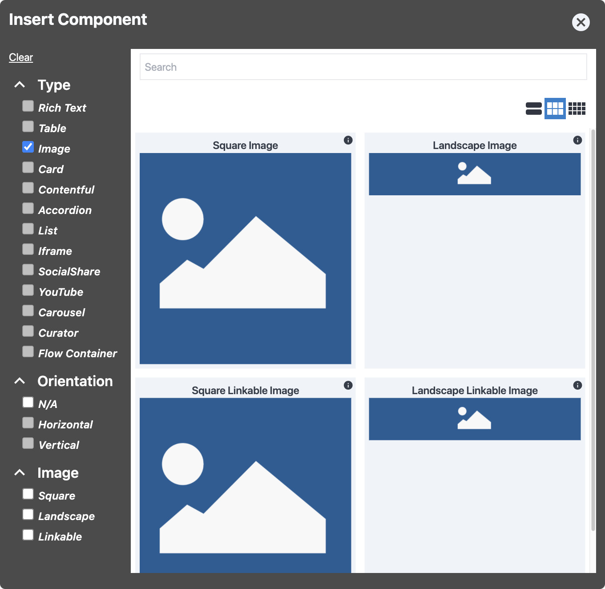

# Image Component

The Image Component in BodilessJS allows you to easily add images to your site. Images can be in
either landscape or portrait mode, depending on your layout needs; and they can be either linkable
or not.

## Content Editor Details

### Add an Image

To add an Image Component to your page:

01. While in [Edit Mode](/ContentEditorUserGuide/#edit-mode), select a [Flow
    Container](../../../Components/FlowContainer/), and, within its context menu, under "Component,"
    click **Add** (or **Swap**, if you're replacing a component).
01. In the "Insert Component" modal, under "Type," check the "Image" checkbox, and select the type
    of image you would like to add.
    - The BodilessJS Starter Kit provides the following image options by default:
      - Square
      - Landscape
      - Square Linkable
      - Landscape Linkable
    - **Note:** Your site may provide a different array of options for the Image Component.
    - Hover over the "i" icon for information about a particular image variation.  
    
01. [Select your image and configure the Image Component](#select-and-configure-an-image).

?> **Note:** The Image Component is included in the Card Component. For information on adding images
to cards, see: [Card Component](../../../Components/Card).

### Select and Configure an Image

To select an image for and configure an Image Component:

01. While in [Edit Mode](/ContenteditorUserGuide/#edit-mode), select the desired Image Component,
    and, within its context menu, under "Image," click **Select**.
01. In the _Image_ modal, fill out the form as necessary.  
    
    - **Src:** The path to the image you would like to use.
      - If you need to upload a new image, use the file upload area at the bottom of the form —
        either drag the image file over it, or click on it to select the image file using your local
        file manager.
    - **Alt:** The alt text for the image.
      - This is alternative text describing the image for users using a screen reader or if the
        image can't be displayed.
      - If this is an image with a link, the text should explain where the link leads.
    - **Title:** The title text for the image.
      - This is additional information for the image; this text will appear in a tooltip when the
        image is hovered over.
01. Click the checkmark in the bottom-right of the form to apply your configuration.
01. If this is a _Linkable_ Image Component, within its context menu, under "Image," click **Edit**
    to [add a link](../../../Components/Link/#add-a-link-to-a-component).
01. You can resize the image by clicking and dragging on the the right-hand side of its Flow
    Container.

## Site Builder Details

You can use this to place an image (usually an `img` tag) on a page via the BodilessJS Edit
interface, and allow the `src`, `alt`, and `title` values to be editable. The Edit interface also
supports image upload.

```jsx
import Image from '@bodiless/components';

<Image nodeKey="imageit" />
```

You can also use the HOC version of this, which can then be applied to other components. But the
underlying component must accept the same props as an `img` tag. Simply pass the node key to the
`asBodilessImage` function, and then use the returned HOC:

```jsx
import { CustomImage } from 'my-library';
import { asBodilessImage } from '@bodiless/components';

const Image = asBodilessImage('linkit')(CustomImage);

<Image />
```

You can also enhance Image picker UI elements. A list of UI elements that can be enhanced can be
found in the `TImagePickerUI` type exported by Image. In order to enhance a UI element, the
enhancement should be injected as a `ui` prop to the Image element. To customize the master wrapper
element:

```jsx
import { Image } from '@bodiless/components';

const UploadArea = () => <div>Some custom text that guide users how to upload image</div>;
const ui = { UploadArea };

<Image ui={ui} />
```

To find a complete example of how to build a custom UI for the Image picker, see
[`@bodiless/components-ui`](https://github.com/johnsonandjohnson/Bodiless-JS/tree/main/packages/bodiless-components-ui).
