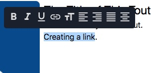
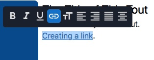

# Link Component

The Link Component allows you to easily add links to your site. Links are used within other
components — such as cards, menus, and images, to name a few.

## Content Editor Details

### The Link Form

When you are able to add a link to a component, you will see an **Edit** button — depicted with a
link icon — within its context menu; click on this button to open the _Link_ form.


Using the _Link_ form, you can provide an existing URL to link to, or upload a file to link to.

- **URL:** To use an existing URL, enter it into the _URL_ field.
  - For _external_ links:
    - Use a fully formed URL (e.g., <https://example.com>).
  - For _internal_ links:
    - Do not use a protocol or domain.
    - Internal links that begin with "./" will be relative to the current page.
    - Internal links that _don't_ begin with "./" will be auto-prefixed with "/" and be relative
      to the site root.
  - All links will have a trailing slash ("/") appended to them.
- **Aria Label:** To improve the screen reader experience, provide an aria label for the link.
  - An aria label entered here will override a programmatically-generated one.
    - This is notable in the event that an auto-generated aria label proves insufficient.
- **File Upload:** To upload a file, drag it into the _File Upload_ area, or click the area and
  select the file.
  - If successful, you will see a confirmation message and the _URL_ field will be auto-filled
    with the relative path to the uploaded file.  
    

### Add a Link to a Component

To set links used within components:

01. In [Edit Mode](/ContentEditorUserGuide/#edit-mode), select a component that utilizes the link
    component (e.g., a linkable image).
01. In the component's context menu, click **Edit** (depicted with a link icon).  
    
01. Using the [_Link_ form](#the-link-form), provide an existing URL to link to, or upload a file to
    link to.
    - If desired, provide an aria label.
01. Click the checkmark to apply your link.

### Add a Link in the Rich Text Editor

To add a link to text in the [Rich Text Editor](../Editors/RichText) (e.g., in the body copy of a
Card):

01. Highlight the text you want to add a link to.  
    
01. In the Rich Text Editor toolbar, click the Link button to format your selected text as a link.  
    
01. Click your now link-formatted text, and, within its context menu, under "Link," click **Edit**
    (depicted with a link icon).  
    
01. Using the [_Link_ form](#the-link-form), provide an existing URL to link to, or upload a file to
    link to.
    - If desired, provide an aria label.
01. Click the checkmark to apply your link.

---

## Site Builder Details

### Usage

```jsx
import { withLinkToggle, Editable, Link } from '@bodiless/components';

const LinkToggle = withLinkToggle(Link);

<LinkToggle nodeKey="linktoggle1">
  <Editable nodeKey="text" placeholder="Link Toggle" />
</LinkToggle>
```

---

## Architectural Details

You can use this to place a link (usually an `a` tag), on the page, that uses the BodilessJS edit
system and allows the `href` attribute to be editable.

  ```jsx
  import { asBodilessLink } from '@bodiless/components';
  const Link = asBodilessLink('link')('a');

  <Link>This is an editable Nodelink.</Link> 
  ```

You can apply `asBodilessLink` to any component which accepts the same props as an `a` tag.

## Customize Link Behavior

The `asBodilessLink` function, like any other `asBodiless...` function, accepts a node key, a
default value, and a `useOverrides` hook; and returns an HOC which makes a link editable. You can
use the `useOverrides` hook to customize the link editor. In particular, you can define a custom
function which will be used to normalize the `href` attribute when the link is saved or displayed.
By default, `asBodilessLink` performs some basic normalization.  Here's an example of how to disable
it:

```ts
const useOverrides = () => ({
  normalizeHref: (href?: string) => href,
  instructions: 'This href will be saved as is.',
});
const DoNotNormalizeLink = asBodilessLink(
  'specify-your-node-key-here', undefined, useOverrides,
)(A);
```

### withLinkToggle

A toggleable link with two states:

- **On:** In this mode, the component wraps its children in the specified wrapper component (Link,
  in most cases.
- **Off:** The component only renders its children.

In Edit Mode, the On/Off state is controlled by a button exposed in the local context menu.
