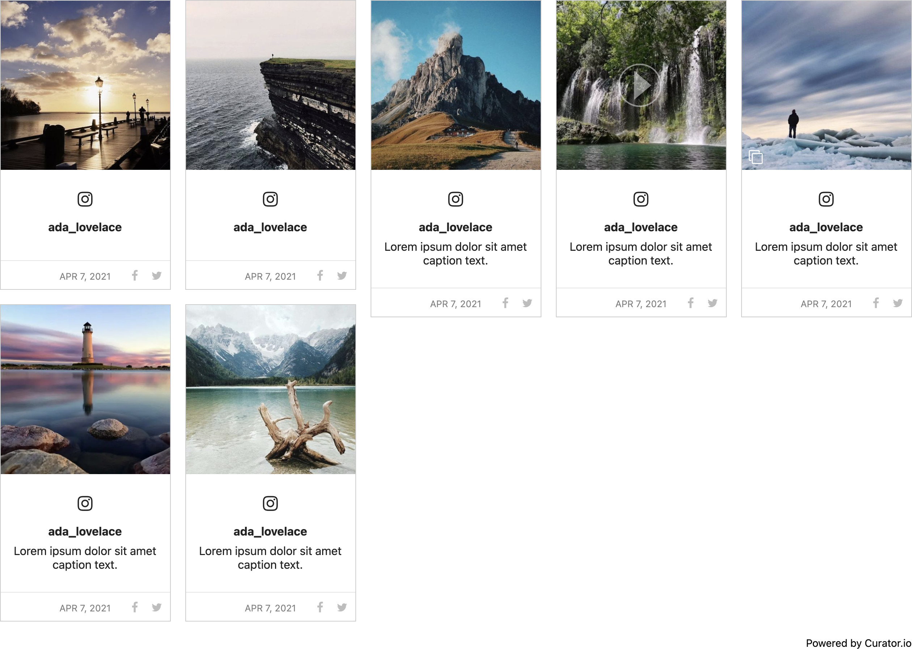

# Social Wall (Curator) Component

The Social Wall Component allows you to configure a content feed, from multiple social media
platforms, to be placed on one or more pages of your site.

## Content Editor Details

The Social Wall Component will not render while in [Edit Mode](/ContentEditorUserGuide/#edit-mode);
in its place, you will see text describing its configuration:

> The Social Wall with Container Id: "CONTAINER-ID" and the Curator URL:
> "https://cdn.curator.io/published/FEED-ID.js" will render here on review mode or the preview
> site.

To see your rendered Social Wall, you will need to view the page it's on either in [Review
Mode](/ContentEditorUserGuide/#review-mode) or on the Preview site (i.e., the published static
site).

### Add a Social Wall (Curator) Component

To add a Social Wall Component to your page:

01. While in [Edit Mode](/ContentEditorUserGuide/#edit-mode), select a [Flow
    Container](/Components/FlowContainer/), and, within its context menu, under "Component," click
    **Add** (or **Swap**, if you're replacing a component).
01. In the "Insert Component" modal, under "Type," check the "Curator" checkbox, and select the
    **Curator** Component.
01. By default, the following placeholder text will appear in the component space:
    > The Social Wall with Container Id: "" and the Curator URL:
    > "https://cdn.curator.io/published/.js" will render here on review mode or the preview site.
01. [Configure your Social Wall Component](#configure-a-social-wall-curator-component).

### Configure a Social Wall (Curator) Component

Feeds are created via [Curator](https://curator.io/), and are each assigned a unique _Feed ID_. You
will need to provide your Social Wall Component with your chosen feed's Feed ID, so that the desired
social media posts are rendered within the component.

01. While in [Edit Mode](/ContentEditorUserGuide/#edit-mode), select a Social Wall (Curator)
    Component, and, within its context menu, under "Curator," click **Settings**.
01. In the associated fields of the "Settings" form, provide the _Feed ID_ and the _Container ID_ of
    the Curator Feed you want rendered in the component.  
    
    - **Feed ID:** The unique ID of a Curator Feed.
      - This can be obtained from your [Curator Dashboard](https://app.curator.io/), under **Style >
        Feed Public Key**.
    - **Container ID:** The HTML identifier attribute (Element `id`) value associated with the
      Curator Container `
` element.
      - This can be obtained from your [Curator Dashboard](https://app.curator.io/), under **Style >
        Advanced**, in the _Container ID_ field.
01. Click the checkmark in the bottom-right of the form to apply your configuration.
01. Switch to [Review Mode](/ContentEditorUserGuide/#review-mode) to ensure that your Social Wall is
    rendering properly.

!>  **Important:** If your page will consist of more than one Social Wall Component, you need to
    ensure that each component has a unique Container ID.  
    From your [Curator Dashboard](https://app.curator.io/), under **Style > Advanced**, you can edit
    the _Container ID_ to be used.

## Site Builder Details

The Social Wall Component integrates with [Curator](https://curator.io/), a third-party social media
aggregator. You can configure your social media feeds in Curator, and add any feed to the Social
Wall Component via its unique _Feed ID_. A benefit of integrating with Curator is that you will not
be required to maintain the various keys associated with your social media accounts, as they will be
managed by Curator.
