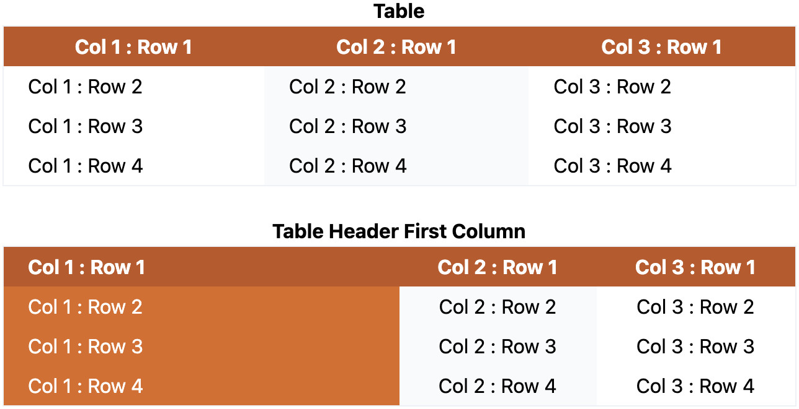
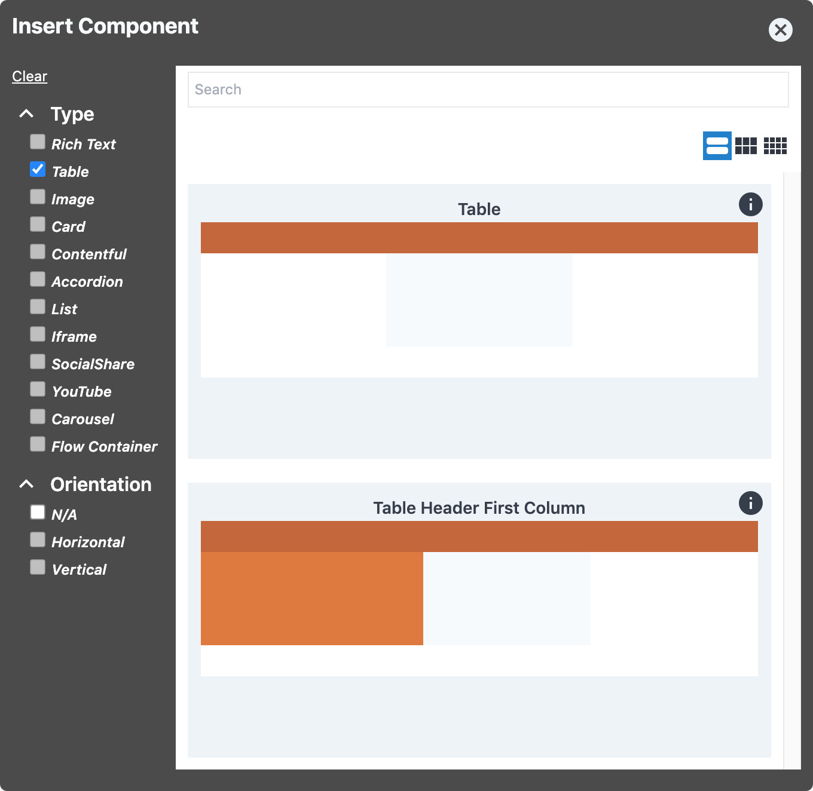
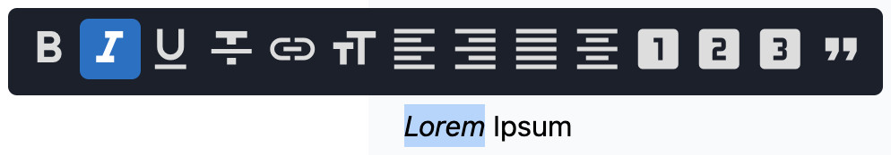
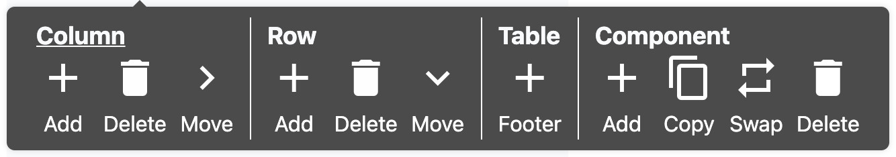

# Table Component

The Table Component provides a way to add tabular data to your site.

## Content Editor Details

The Table Component Edit UI allows for table rows and columns to be added, deleted, and reordered.

### Component Variations

By default, two variations of the Table Component are available to choose from:



- **Table:** A table with a header row.
- **Table Header First Column:** A table with a header row _and_ a header column.

### Add a Table

To add a Table Component to your page:

01. While in [Edit Mode](/ContentEditorUserGuide/#edit-mode), select a [Flow
    Container](/Components/FlowContainer/), and, within its context menu, under "Component," click
    **Add** (or **Swap**, if you're replacing a component).
01. In the "Insert Component" modal, under "Type," check the "Table" checkbox, and select the table
    variation you would like to add.
    - See details about the default table variations under [Component
      Variations](#component-variations).
    - Hover over the "i" icon for information about a particular table variation.  
    

### Edit and Format Table Text

To _edit_ the text within a Table Component, select the table cell you'd like to edit, and enter the
desired text.

To _format_ the text within a Table Component, highlight the text you'd like to format, and use the
[Rich Text Editor](./Editors/RichText) formatting toolbar that pops up.



?> **Note:** Bulk cell-selection (highlighting) is not possible; you can only highlight — and,
   therefore, _format_ — text within a single cell at a time.

?> **Note:** For more information on the _Rich Text Editor_, please see: [Rich Text Editor
   Component](./Editors/RichText).

### Add Columns and Rows

You can add columns and rows to a Table Component using the context menu. (You must be in [Edit
Mode](/ContentEditorUserGuide/#edit-mode).)



- [Add a Column](#add-a-column)
- [Add a Row](#add-a-row)
- [Add a Header Row](#add-a-header-row)
- [Add a Footer Row](#add-a-footer-row)

#### Add a Column

To add a column to your table:

01. Select the column to the left of where you would like to add a new column.
01. From the context menu, under "Column," click **Add**.  
      
    A new column will appear to the right of the column you selected.

<!-- Inlining HTML to add multi-line info block with ordered list. -->
<div class="warn">
  <strong>Note:</strong> To add a new column to the first column position:

  01. **Add** a column to the second column position.
  01. [**Move**](#move-columns-and-rows) the first column.

</div>

?> **Note:** If you're using the _Table Header First Column_ Table variant, you can only have one
header column. (This is unlike header _rows_, of which there can be multiple.)

#### Add a Row

To add a body (i.e., non-header/non-footer) row to your table:

01. Select the row above where you would like to add a new row.
    - **Note:** Selecting a _header_ or _footer_ row will not provide the correct context menu.
      - If you want to add a body row directly below a header row, see the note below.
      - If you want to add a body row directly below a footer row, you can't; only more footer
        rows can be added below a footer row.
01. From the context menu, under "Row," click **Add**.  
      
    A new row will appear below the row you selected.

<!-- Inlining HTML to add multi-line info block with ordered list. -->
<div class="warn">
  <strong>Note:</strong> To add a new body row directly below the header row(s):

  01. **Add** a row below the topmost body row.
  01. [**Move**](#move-columns-and-rows) the topmost body row.

</div>

#### Add a Header Row

Both of the default Table Component variants already have a header row, but you're able to add as
many as you require.

Header rows can only be positioned in the header (upper) region of a table — they cannot be _added_
or _moved_ below it. Body rows and footer rows cannot be positioned above a header row.

To add a header row to your table:

01. Select the header row above where you would like to add a new header row.
01. From the context menu, under "Header Row," click **Add**.  
      
    A new header row will appear below the header row you selected.

<!-- Inlining HTML to add multi-line info block with ordered list. -->
<div class="warn">
  <strong>Note:</strong> To add a new header row as the first (topmost) header row:

  01. **Add** a header row below the current topmost header row.
  01. [**Move**](#move-columns-and-rows) the topmost header row.

</div>

#### Add a Footer Row

Footer rows are typically used for column summaries. Neither of the included Table Component
variants include a footer row by default, but you may add as many as you require.

Footer rows can only be positioned in the footer (lower) region of a table — they cannot be _added_
or _moved_ above it. Body rows and header rows cannot be positioned below a footer row.

To add a footer row to your table:

- If your table doesn't have a footer row yet:
  01. You may select anywhere on the table.
  01. From the context menu, under "Table," click **Footer** (designated with an "add" icon
      (**+**)).  
        
      A footer row will be added to the bottom of your table.
- If your table already has one or more footer rows:
  01. Select the footer row above where you would like to add a new footer row.
  01. From the context menu, under "Footer Row," click **Add**.  
        
      A new footer row will appear below the footer row you selected.

<!-- Inlining HTML to add multi-line info block with ordered list. -->
<div class="warn">
  <strong>Note:</strong> If there are already one or more footer rows in your table, and you need to
  add a new footer row as the first (topmost) footer row (i.e., directly below the bottommost
  body row):

  01. **Add** a footer row below the current topmost footer row.
  01. [**Move**](#move-columns-and-rows) the topmost footer row.

</div>

Out of the box, footer rows don't appear any different from body rows — and, depending on the
styling of your site, this may remain the case. If you need to discern whether a row is a body row
or a footer row, simply select it, and, in its context menu, you will see either a "Row" section or
a "Footer Row" section, revealing the type of row that it is.

### Delete Columns and Rows

To delete a column or row from your table:

01. Select a table cell in the column or row that you would like to remove.
01. From the context menu, under "Column" or "Row," click **Delete**.  
      
    The selected column or row will be removed from your table.
    - **Note:** A selected header or footer row will have the "Row" section in the context menu
      replaced with the according "Header Row" or "Footer Row" section.

?> **Note:** If you're using the _Table Header First Column_ Table variant, the column in the first
(leftmost) position is always styled as the header column. If you delete the header column, the
second column will become the first column, and, thus, become the new header column.

### Move Columns and Rows

Using the **Move** button in the context menu, columns and rows can be reordered.

The **Move** operation moves items in a single direction:

- Columns are moved to the right.
  - I.e., a moved column will swap places with the column to its immediate right.
- Rows are moved down.
  - I.e., a moved row will swap places with the row directly below it.

To move a column or row:

01. Select a table cell in the column or row that you would like to reorder.
01. From the context menu, under "Column" or "Row," click **Move**.  
      
    The selected column or row will be moved to the right or down, respectively.
    - **Note:** A selected header or footer row will have the "Row" section in the context menu
      replaced with the according "Header Row" or "Footer Row" section.

?> **Note:** If you're using the _Table Header First Column_ Table variant, the column in the first
(leftmost) position is always styled as the header column. If you move the header column, the data
from the first column will be swapped with that of the second, and the first column (which now
contains what was the second column's data) will continue to be styled as the header column.

?> **Note:** A row can't be moved out of its respective region.  
<br>
Header, body, and footer rows are restricted to the upper, middle, and lower regions of the table,
respectively, and cannot be reordered out of those regions.  
(E.g., a header row can't be moved below a body row.)

## Site Builder Details

### Usage

```js
const TableExample = asToken(
  withDesign({
    Header: addClasses('text-center'),
  }),
  asBodilessTable(),
  asDefaultTableStyle,
)(CleanTable);
```

The table is made editable via `asBodilessTable()`.

```jsx
<TableExample nodeKey="table-1" />
```

## Design Components

The Table Component follows the Bodiless Design Pattern and is easy to style. Styling can be
implemented in the appropriate `token.tsx` file by adding the necessary Tailwind classes (see
`asTableDefaultStyle` in
[`examples/test-site/src/components/Table/index.tsx`](https://github.com/johnsonandjohnson/Bodiless-JS/blob/main/examples/test-site/src/components/Table/index.tsx)).  
Here is an example demonstrating all possible design components:

```js
import { withDesign, addClasses } from '@bodiless/fclasses';

const asTableExampleStyle = withDesign({
  Wrapper: addClasses('p-3'),
  THead: addClasses('bg-gray-200'),
  TBody: addClasses('text-primary'),
  TFoot: addClasses('ml-2'),
  Row: addClasses('ml-2'),
  Cell: addClasses('border border-solid border-gray-200'),
});
```

Because each Cell knows where it is in the table, it is possible to use conditional styling. There
are several helper functions for this; or you can provide a custom function with all Cell Props, as
well as table data.

```js
import { withDesign, addClasses, addClassesIf, and, not } from '@bodiless/fclasses';
import { useIsFirstColumn, useIsOddColumnn } from '@bodiless/organisms';

const asTableExampleStyle = withDesign({
  Cell: asToken(
    /**
     * Here, we apply a dark column to alternating rows in the Body, left-align
     * text in the first column, and center-align text in the remaining columns.
     */
    addClassesIf(and(useIsInBody, useIsOddColumnn))('bg-gray-200'),
    addClassesIf(useIsFirstColumn)('text-left'),
    addClassesIf(not(useIsFirstColumn))('text-center'),
    /**
     * Here, we use a custom function to style the penultimate column.
     */
    addClassesIf((p) => p.columnIndex === (p.tableData.columns.length - 2))('bg-color-orange-700'),
  ),
});
```

?> **Note:** `useIsOddColumnn` is the name of the function, and is not a typo in the documentation.

## Architectural Details

The Table Component will render as a typical HTML `<table>` element.

For example, the following TSX—

```tsx
const TableExample = asToken(
  asTableCenterText,
)(StandardTable);

export default (props: any) => (
  <Page {...props}>
    <Layout>
      { /* @ts-ignore missing unnecessary rows, columns, headRows and footRows props */ }
      <TableExample nodeKey="table-1" data-list-element="outerlist" />
    </Layout>
  </Page>
);
```

—Will render an HTML `<table>` element like the following (a number of details have been stripped
for demonstration purposes):

```html
<table data-bl-design-key="Table:Wrapper" data-list-element="outerlist" class="...">
  <thead data-bl-design-key="Table:THead" class="...">...</thead>
  <tbody data-bl-design-key="Table:TBody">
    <tr data-bl-design-key="Table:Row">
      <td data-bl-design-key="Table:Cell" class="text-center ...">...</td>
      <td data-bl-design-key="Table:Cell" class="text-center ...">...</td>
      <td data-bl-design-key="Table:Cell" class="text-center ...">...</td>
    </tr>
    <tr data-bl-design-key="Table:Row">...</tr>
    <tr data-bl-design-key="Table:Row">...</tr>
  </tbody>
  <tfoot data-bl-design-key="Table:TFoot"></tfoot>
</table>
```

Note that header and footer rows are appropriately positioned within `<thead>` and `<tfoot>`
elements, respectively.
