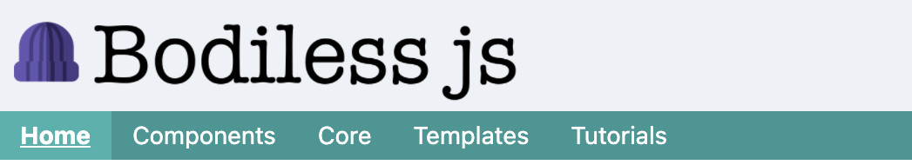
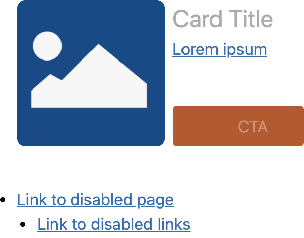
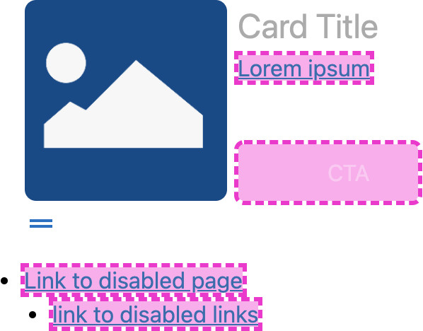

# Disable Status

From the [_Page_ menu](../), click the **Disable** button to disable various features of
the current page, or the page itself.

The disablement of a page means that the page will not be rendered/available on the Preview site
(i.e., the published static site), but will still exist in [Edit](../../#edit-mode) and [Review
Mode](../../#review-mode). This allows you to temporarily take a page offline but retain its
content. If you believe the page will be permanently offline, we recommend you use the
[**Delete**](../Delete/) operation to remove the page from your site (_Note:_ This _will_ result in
a loss of that page's content).

Disabling the more granular features related to a page will alter the Preview/Review/Edit Mode
experiences differently, depending upon the feature(s) selected.

For information regarding the disablement of each feature, please see:

* [Page](#disable-page)
  * [Menu links](#disable-menu-links)
  * [Non-menu links](#disable-non-menu-links)
  * [Indexing](#disable-indexing)

If any of the features on the page are disabled, the "Disable" button will be highlighted in blue.

To disable features:

01. Click the **Disable** button to open the _Disable Status_ form; this will present you with
    a list of features that you can disable.
    * By default, none of the features are disabled.
01. Select the checkbox of each feature that you would like to disable.
01. Click the checkmark in the bottom-right of the form to apply your selection.
    * As confirmation, you will be shown the current _Disable Status_ of the page.  
      
01. Click the "X" icon to close the form.

## Disable Page

Select the "Page" checkbox to mark the page and all the nested features for disablement:

* [Menu links](#disable-menu-links)
* [Non-menu links](#disable-non-menu-links)
* [Indexing](#disable-indexing)

Likewise, to _deselect_ all the nested features, deselect the "Page" checkbox.

## Disable Menu Links

To disable menu links leading to the current page, select the "Menu links" checkbox.

When disabled, any menu links targeting the current page will not be visible in Preview (Static) or
Review Mode (i.e., for each of the affected links, neither the anchor element or the link text will
be rendered). Disabled menu links _will_, however, still be visible and functional in Edit Mode.
While in Edit Mode, disabled menu links will be made visibly clear by being highlighted in fuchsia,
and will display "Link Disabled" on hover.

!>  **IMPORTANT:** Your site may exhibit different behavior than that depicted in the proceeding
    screenshots, as the site-level styling of the menu will take precedence and may
    hide/override/camouflage the editor's styling.

**Review Mode**  

**Edit Mode**  

?>  **Note:** The page will still be reachable directly (via its URL), regardless of menu links
    being disabled — even if the page itself has been disabled.

## Disable Non-Menu Links

Select the "Non-menu links" checkbox to disable all links leading to the current page that appear in
components utilizing the BodilessJS [Link Component](/Components/Link/) (e.g., links created using
the [Rich Text Editor Component](/Components/Editors/RichText) or [Card
Component](/Components/Card)).

When disabled, any links targeting the current page — that aren't in menus — will not be rendered in
Preview (Static) or Review Mode (i.e., for each of the affected links, the anchor element will not
be rendered, but the link text will be). Disabled non-menu links _will_, however, still be visible
and functional in Edit Mode. While in Edit Mode, disabled menu links will be made visibly clear by
being highlighted in fuchsia. In all modes, non-menu links will display "Link Disabled" on hover.

| Review Mode | Edit Mode |
| ----------- | --------- |
|  |  |

?>  **Note:** The page will still be reachable directly (via its URL), regardless of non-menu links
    being disabled — even if the page itself has been disabled.

## Disable Indexing

Select the "Indexing" checkbox to remove the page's URL from the `sitemap.xml` file and add it to
the `robots.txt` file. This will prevent search engines from discovering the page, as well as block
them from indexing it if it has already been discovered.

?>  **Note:** This feature is still under development.
