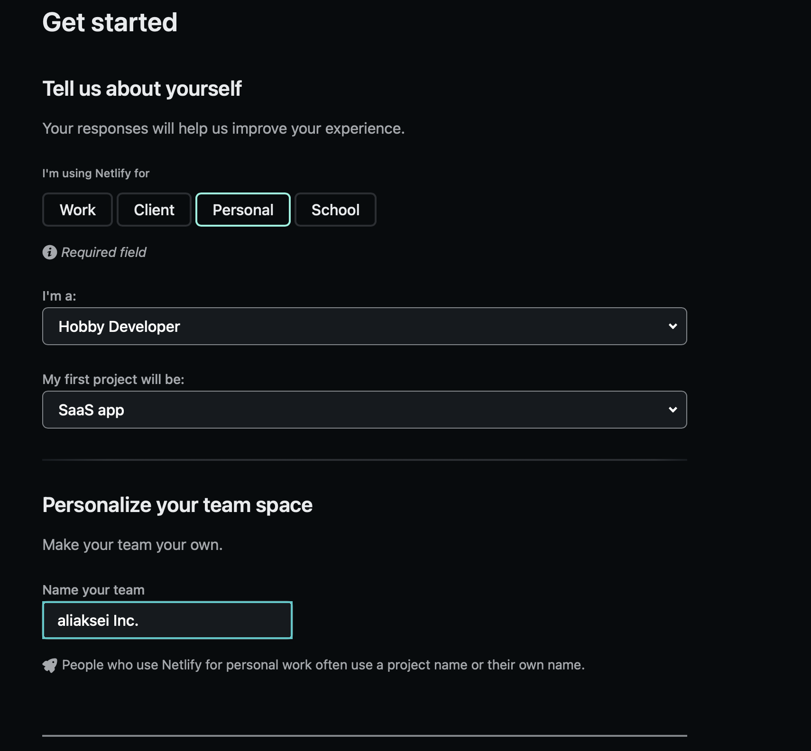
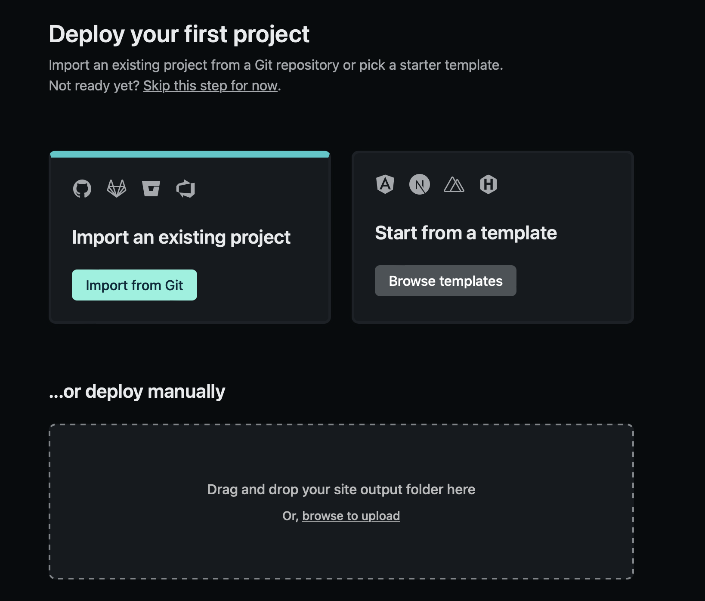
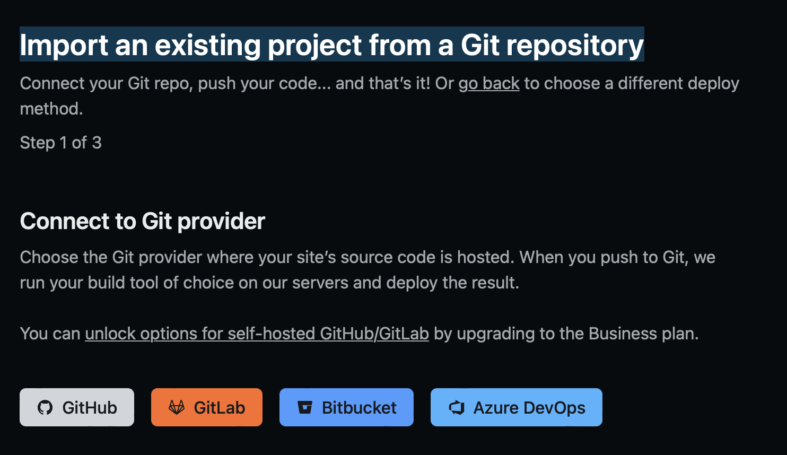
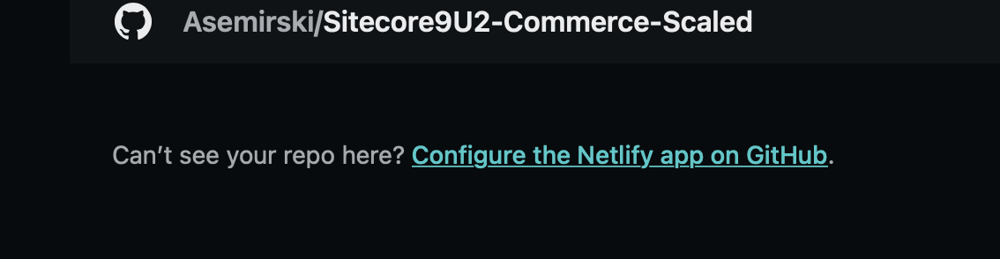
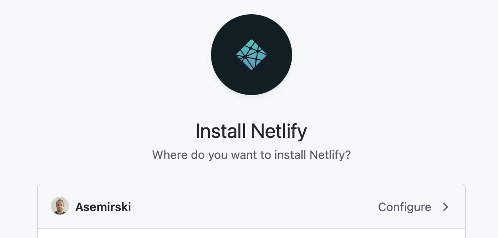
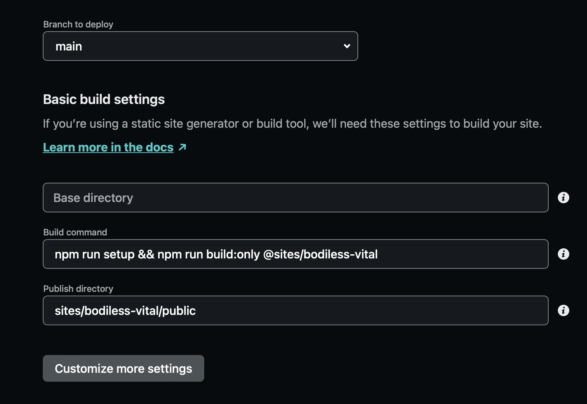

# Using Netlify with BodilessJS

## Onboarding Process for Netlify

?> **Note:** In the following instructions, GitHub is used as an example login and source code
provider. If you're using a different supported provider (e.g., GitLab or Bitbucket), adapt the
instructions as needed.

01. Go to [https://app.netlify.com](https://app.netlify.com ':target=_blank').

01. Log in using GitHub.
    - Or use a different account (e.g., GitLab or Bitbucket), if applicable.

01. On the "Get started" page, fill in your details and click the **Set up and continue** button.  
    

01. On the "Deploy your first project" page,  click the **Import from Git** button.  
    

01. On the "Import an existing project from a Git repository" page, choose a source code provider.  
    (We'll continue to use GitHub as our instructional example.)  
    

01. Assuming that this is your first time performing this process, Netlify will show your user
    account as having no repos; scroll down the page, and click the link to **Configure the Netlify
    app on GitHub**.  
    

01. In the "Install Netlify" pop-up window:
    01. Select the user or organization where your project is located, and click **Configure**.
        - Or just select the user/project, if the **Configure** option is absent.
    01. Provide your git password on the next page.  
    

01. Configure the Netlify app to access either all of your repos or some specific repos.
    - In this example, we gave access to all of the user repos.

01. You will be redirected to the main browser window. Choose your desired repository from the list
    there.

01. Choose a branch to deploy, and then click the **Customize build settings** button.

    01. Leave the "Base directory" field empty.

    01. Set the "Build command" to:

        ```
        npm run setup && npm run build:only @sites/{site-name}
        ```

        Where `{site-name}` is the name that you gave during the site generation process via the
        `@bodiless/cli` package (for reference, see: [Creating a New
        Site](/About/GettingStarted#creating-a-new-site)).
        - Additionally, it can be found under `PROJECT_DIRECTORY/sites/SITE_NAME`.  
          (In our example screenshot below, it is `bodiless-vital`.)

    01. Set the "Publish directory" to `sites/{site-name}/public`.  
        

01. Click the **Deploy site** button.

> Please note that only the static site (not the edit environment) can
> be hosted on Netlify.  If you want to make edit environments
> accessible in the cloud, the most fully supported option at present is
> through [platform.sh](../Platform.sh.md);
