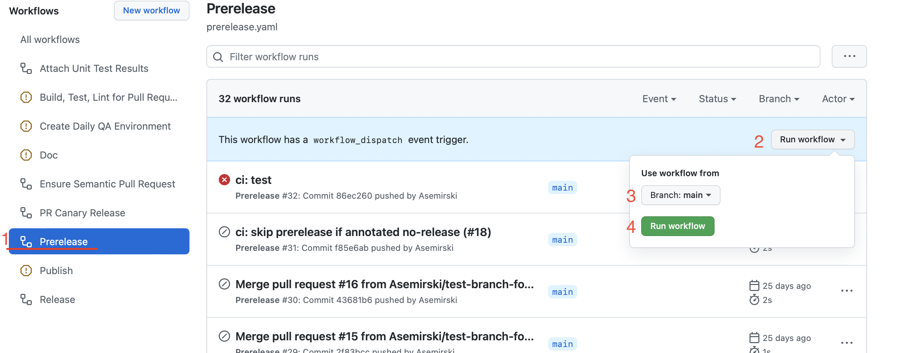
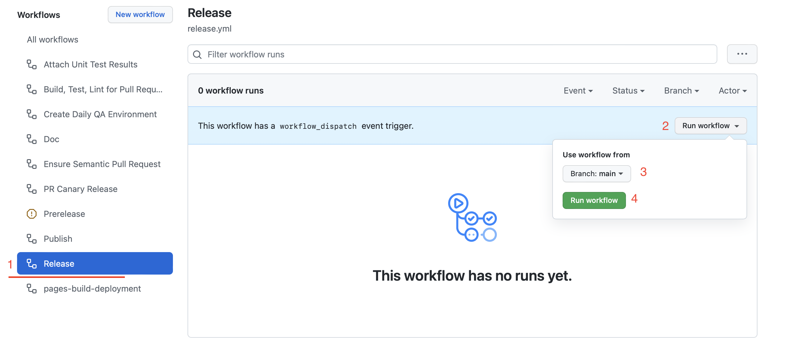

# Releases

We adhere to the principles of [Semantic Versioning](https://semver.org/ ':target=_blank') for the
framework as a whole. All Bodiless packages maintain a common version line at `X.y.z`. This means
that an individual package may receive a version bump even if it does not have any changes.

In most cases, Bodiless releases are produced automatically, and version calculation is performed
based on the [Conventional Commits](https://www.conventionalcommits.org/ ':target=_blank') standard.
In certain exceptional circumstances (e.g., new major releases) we may produce a new release
manually with an explicit version.

## Normal Release Process

### Pre-Releases

Normally, pre-releases are produced automatically in response to certain events:

- [Canary Releases](#canary-releases)
- [Beta Releases](#beta-releases-pre-release)

#### Canary Releases

Any pull request (PR) can produce a _canary release_. Such releases are not tagged in the
repository, but _are_ published to [npm](https://www.npmjs.com/org/bodiless ':target=_blank').

To create a canary release, put the `[canary]` annotation in your PR title (if you have more than
one commit) or in your commit message (if you have only one commit). This annotation may be inserted
anywhere in the PR title or commit message as long as it's _after_ the (optional) scope.

For example:

- `<type>(optional-scope): [canary] <description>`
- `fix(api): [canary] fix endpoint`

The generated release version will take the following form:

- `<CURRENT_VERSION>-canary-<PR_NUMBER>-<BUILD_NUMBER>`
  - E.g.: `1.0.0-canary-1797-264.0`

The [distribution tag](https://docs.npmjs.com/adding-dist-tags-to-packages ':target=_blank')
(dist-tag) published to npm will be of the form:

- `canary-<PR_NUMBER>`

#### RC Releases (Pre-Release)

Any commit to the main branch will produce a _rc release_. These releases are tagged in the
repository, and will receive the `next` [distribution
tag](https://docs.npmjs.com/adding-dist-tags-to-packages ':target=_blank') (dist-tag) in npm.

The version numbers are calculated using [Lerna](https://lerna.js.org/ ':target=_blank')'s
[`conventional-commits`](https://github.com/lerna/lerna/tree/main/commands/version#--conventional-commits
':target=_blank') and
[`conventional-prerelease`](https://github.com/lerna/lerna/tree/main/commands/version#--conventional-prerelease
':target=_blank') flags.

<!-- Inlining HTML to add multi-line info block with and disclosure widgets. -->
<div class="warn">
  <strong>Note:</strong> You may prevent a commit to the main branch from producing a release by
  using the <code>[no-release]</code> annotation:

  <details>
  <summary><strong>Merge</strong> commit:</summary>
  <div style="margin-left:20px;">

  If you're performing a **merge** commit (e.g., via the GitHub UI), add `[no-release]` to the merge
  message.

  E.g., `Merge pull request #42 from adalovelace/quick-fix [no-release]`.

  </div>
  </details>

  <details>
  <summary><strong>Squash</strong> commit:</summary>
  <div style="margin-left:20px;">

  If you're performing a **squash** commit:

  - For a single commit, the commit message should be the same as the PR title, and it should
    contain `[no-release]`.
  - For more than one commit, the PR title should contain `[no-release]`.


  This annotation may be inserted anywhere in the PR title or commit message as long as it's _after_
  the (optional) scope.

  E.g., `fix(api): [no-release] fix endpoint`.

  Also, the `[no-release]` annotation can be added to the _merge_ commit message if adding it to the
  _squash_ commit message was missed or ignored.

  </div>
  </details>

</div>

Additionally there is an option to run a RC Release manually.



To execute a RC Release manually perform the following steps from the [Actions](https://github.com/johnsonandjohnson/Bodiless-JS/actions ':target=_blank')
tab of the BodilessJS GitHub page::

01. Under the _Workflows_ list, select the **Prerelease** workflow.
01. Click **Run workflow**.
01. From the _Use workflow from_ dropdown, select the branch to perform conventional prerelease.
    - By default, it's the repository's main (default) branch.
01. Click **Run workflow**.

### Full Releases

When you are ready to graduate a _pre_-release to a _full_ release, execute the "Release" GitHub
action manually.



From the [Actions](https://github.com/johnsonandjohnson/Bodiless-JS/actions ':target=_blank') tab of
the BodilessJS GitHub page:

01. Under the _Workflows_ list, select the **Release** workflow.
01. Click **Run workflow**.
01. From the _Use workflow from_ dropdown, select the branch to graduate.
    - By default, it's the repository's main (default) branch.
01. Click **Run workflow**.

## Fully Manual Release Process

In some cases we may wish to override the version calculation for a release or pre-release. In such
cases, we can employ a fully manual process as follows:

01. Create a `release` branch from `main` on
    [GitHub](https://github.com/johnsonandjohnson/Bodiless-JS/ ':target=_blank').
    - The `release` branch should be removed automatically after a release merges to `main`.  
      So, here, we are creating a fresh `release` branch off `main` for the new release.
01. Create a fresh clone of the repository.
01. Checkout the `release` branch, e.g.:
    ```shell-session
    git checkout -b release origin/release
    ```
01. Merge in the latest commits from `main`.
    ```shell-session
    git merge main
    ```
01. Initialize all dependencies, and build the project.
    ```shell-session
    npm run setup
    npm run build
    ```
01. Create new package versions.
    ```shell-session
    npm run publish:<UPDATE_TYPE>
    ```
    This will execute the `lerna version` command with required flags.
    - For `<UPDATE_TYPE>`, substitute the type of version update (i.e., `patch`, `minor`, or
      `major`).
    - For a manual _pre_-release, you must execute `lerna version` manually and specify the exact
      version you would like to release, e.g.:
      ```shell-session
      npx lerna version 1.0.0-beta.1 --conventional-commits --force-publish
      ```
    - For information on these Lerna command flags, please see Lerna's documentation:
      - [`--conventional-commits`](https://github.com/lerna/lerna/blob/main/commands/version/README.md#--conventional-commits ':target=_blank')
      - [`--force-publish`](https://github.com/lerna/lerna/blob/main/commands/version/README.md#--force-publish ':target=_blank')
01. Create a PR to `main` from the `release` branch.
    - The PR title should emulate the following form: `chore: Release v1.0.45`
    - Commits in the PR should _not_ be squashed, since the tag is already attached to the
      appropriate commit hash.
    - The version you created in the previous step will be automatically published to npm via a
      GitHub "publish" action when you push to the `release` branch of origin.
      - Publication will happen on push — **not** on merge to `main`.

!> **IMPORTANT:** Ensure that you **do not squash/merge the release branch**. You _must_ use the
   "fast-forward" merge strategy.
