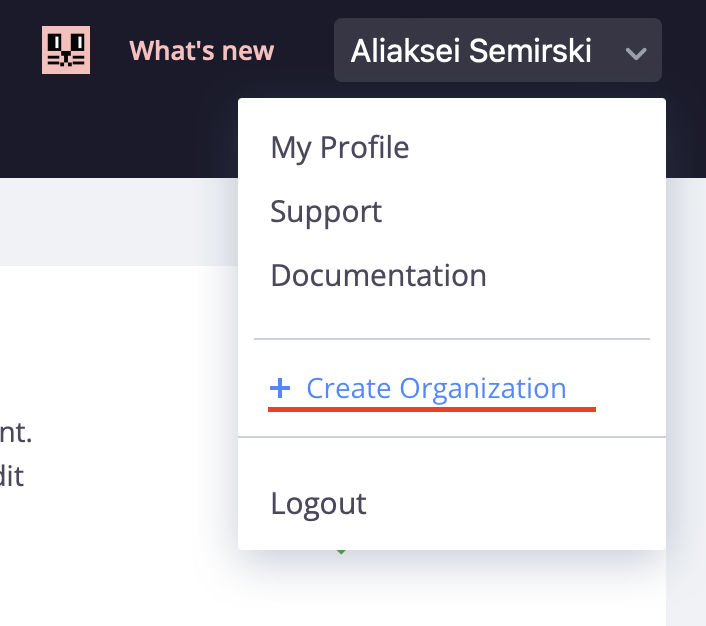
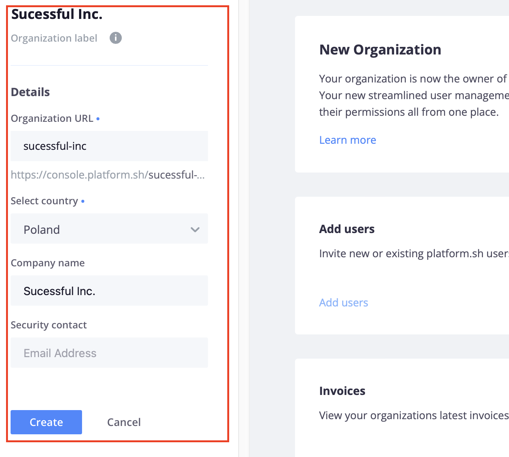
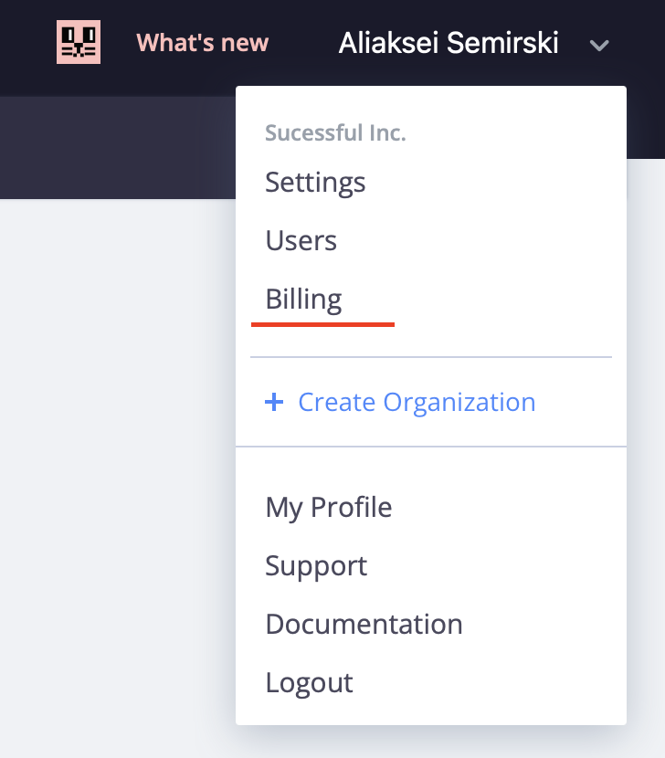
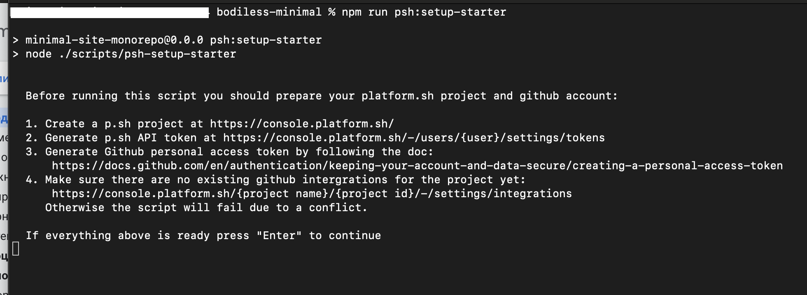

# Using Platform.sh with BodilessJS

?> **Note:** Bodiless deployment on Platform.sh requires at least 15GB of storage available, so
the paid plan is requried.

?> **Note:** In the following instructions, GitHub is used as an example source code
provider. If you're using a different supported provider (e.g., GitLab or Bitbucket), adapt the
instructions as needed.

?> **Note:** The following instruction assumes that you have a Platform.sh account registered already.

?> **Note:** The following instruction assumes that you have a Platform.sh account API Token created.

?> **Note:** The following instruction assumes that you have a GitHub personal access token generated.

01. Go to [https://console.platform.sh](https://console.platform.sh ':target=_blank').

01. In order to add payment method create an organization first.
    01. On the top right corner click on the user name.
    01. On the drop-down click **Create Organization**  
        
    01. On the "Create Organization" page fill in the organization details.
        
    01. Click **Create** button.

01. Once the organization is created procced with adding billing details.
    01. On the top right corner click on the user name. For now there should be your organization. Click **Billing**.  
        

        - If no organization appeared in the drop-down, go to the "All Projects" page by clicking the Plathform.sh icon top left corner, click on the **All projects** drop-down and select the organization created previously. After that follow the instructions provided in point above.

    01. Fill in the "Credit Card" and "Billing Details".

01. Switch back to the "All Projects" page and select the organization.

01. On the top right cornect click **Create Project** button.

01. On the "New Project" pop-up click on the **Create from scratch** option.


01. On the "Details" tab provide the project details.

01. Click on the **Create Project** button.
    - In case of "Plan & Pricing" pop-up click **Continue**.

01. Go to the project page and click **Upgrade button** near the development Plan.


01. On the "Upgrade plan" page scroll to "Storage" option and select 15GB fromt the drop-down. Click **Save** on the bottom right corner and **Back To Project** on the top left corner.

01. Switch to the project root on the local machine, e.g. `~/bodiless-minimal`
01. Using commandline run
    ```
    npm run setup
    npm run psh:setup-starter
    ```
01. Make sure that all of the requirements listed are met.  

01. Provide requried input parameters. The script will return 'Success' response to the console, if all the parameters were provided correctly and integration with Platform.sh and project variables are created.
01. After integration is created the deploy of the main branch will be triggered automatically.
