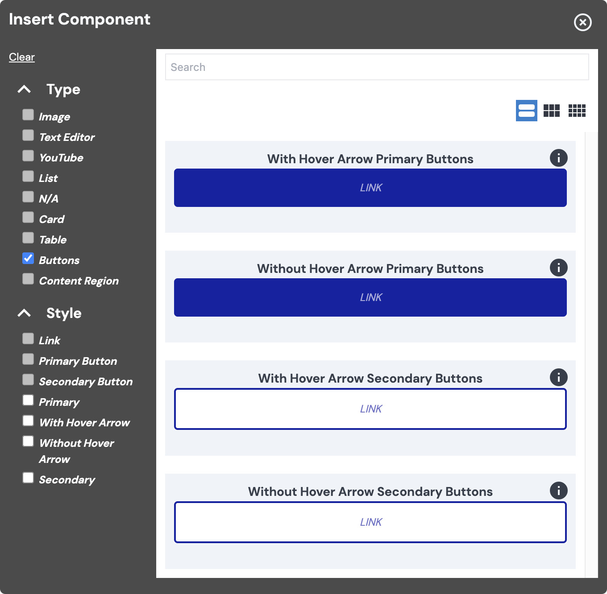

# Vital Button Component

The Vital Button Component is a stylized version of the [Vital Link Component](../VitalLink). While
Vital Link is a generic Link component with tokens that can be combined however you choose, Vital
Button builds upon it, providing a sensible default combination of its generic tokens (i.e.,
features and styles), to help meet typical site-use expectations.

- Provides an Editable Button component;
- Provides Primary & Secondary Button components;
- Provides Button with hover arrow token;
- Uses [Vital `PlainEditor`](../VitalEditors/PlainEditor) under the hood.

## Button Variants

Vital Buttons provides the following Button variants by default:

- With Hover Arrow Primary Buttons
- Without Hover Arrow Primary Buttons
- With Hover Arrow Secondary Buttons
- Without Hover Arrow Secondary Buttons

Here is a showcase of the Button variants, along with their hover states:

  
_(Right-click and "Open Image in New Tab" to view full-size image.)_

As you can see in the image above, when hovered over, the "With Hover Arrow" variants display a
right-pointing arrow at the end of the Button text.

## Content Editor Details

?> **Note:** When using icon fonts, some screen readers try to read pseudo-element icons out loud.
For this reason, if you're adding a Link to an external URL or a downloadable file, it's recommended
that you provide an `aria-label`, making the accessibility tree consistent between screen readers.

### Add a Button

To add a Vital Button Component to your page:

01. While in [Edit Mode](/ContentEditorUserGuide/#edit-mode), select a [Flow
    Container](/Components/FlowContainer/), and, within its context menu, under "Component," click
    **Add** (or **Swap**, if you're replacing a component).
01. In the "Insert Component" modal, under "Type," check the "Buttons" checkbox, and select the type
    of Button you would like to add.
    - For information on the types of Buttons available, see: [Button Variants](#button-variants).
    - **Note:** Your site may provide a different array of options for the Button component.
    - Hover over the "i" icon for information about a particular Button variant.  
    
01. [Edit your Button](#edit-a-button) as desired.

### Edit a Button

After [adding a Vital Button](#add-a-button), while in [Edit
Mode](/ContentEditorUserGuide/#edit-mode):

01. Select the placeholder (or existing) text of the Button, and begin typing to update the Button
    text.
    - Note: If you're updating the placeholder text, you won't see a text cursor until you begin
      typing.
01. Select the Button, and, within its context menu, under "Link," click **Edit**.
    - The workflow for editing a Button Link is the same as that of the Link Component; for details,
      refer to: [Link Component : Content Editor Details](/Components/Link/#content-editor-details).

## Site Builder Details

### Usage

```jsx
import { withNodeKey } from '@bodiless/data';
import { ButtonClean, vitalButtons } from '@bodiless/vital-buttons';

const DefaultButton = as(
  vitalButtons.Default,
  withNodeKey('defaultbutton'),
)(ButtonClean);
```

### Overriding Buttons

#### Via Shadowing (*Preferred Method)

Define a Shadowing token collection as defined in [Shadowing Tokens](../../Guides/ShadowingTokens).

File to shadow: `packages/{my-package}/src/shadow/@bodiless/vital-buttons/Buttons.ts`
