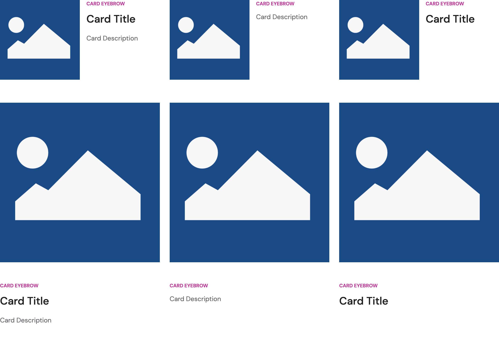
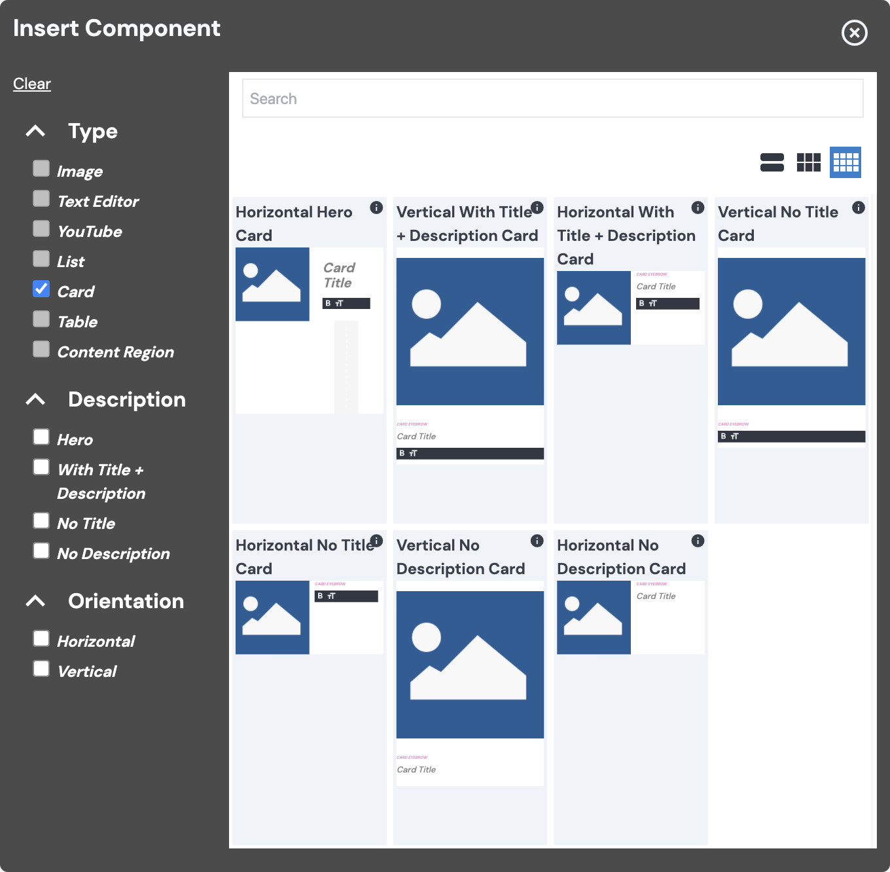
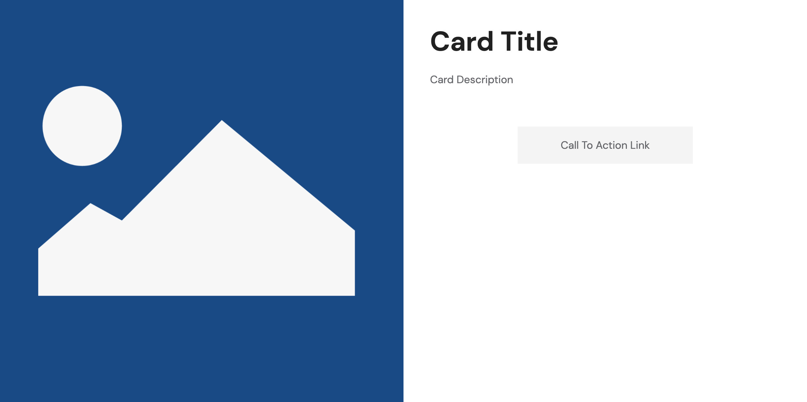

# Vital Card Component

Vital Card is a group of content which typically features a less than full-size image alongside
supporting content or a call to action (CTA). Cards are commonly used on websites to call out or
offer something to the site visitor.

## Component Variations

The Vital Card package provides a clean Card component as well as the following Card design variants
to promote a quicker and easier site build experience:

- Basic Card
- Hero Card
- Horizontal Card
- Vertical Card
- No Title Card
- No Description Card

In the screenshot below, you can see examples of the Card variants that are available out of the
box; the top row is _Horizontal_ Cards and the bottom row is _Vertical_ Cards.



<!-- Center the table, to make relation with Card Variants image more clear. -->
<style>
  table {
    margin: 0px auto !important;
    display: table !important;
  }
</style>

|                | 1<sup>st</sup> Column | 2<sup>nd</sup> Column | 3<sup>rd</sup> Column |
| -------------- |:---------------------:|:---------------------:|:---------------------:|
| **Horizontal** | Title + Description   | No Title              | No Description        |
| **Vertical**   | Title + Description   | No Title              | No Description        |

## Content Editor Details

Cards are composed of a combination of the following parts:

- Image
- Eyebrow
- Title
- Description
- Link/CTA

For details on each of these items, see [Edit and Configure a Card](#edit-and-configure-a-card)
below.

### Add a Card

To add a Card Component to your page:

01. While in [Edit Mode](/ContenteditorUserGuide/#edit-mode), select a [Flow
    Container](/Components/FlowContainer/), and, within its context menu, under "Component," click
    **Add** (or **Swap**, if you're replacing a component).
01. In the "Insert Component" modal, under "Type," check the "Card" checkbox, and select the card
    variation you would like to add.
    - See details about the default Card variations under [Component
      Variations](#component-variations).
    - Hover over the "i" icon for information about a particular Card variation.
    - Use additional filters to refine your choices (e.g., check a checkbox under "Orientation" to
      view only Horizontal or Vertical Cards).  
    

<!-- Inlining HTML to add multi-line info block with unordered list. -->
<div class="warn">
  <strong>Note:</strong> Regarding the Hero Card:

  You're able to select a Hero Card from the "Insert Component" modal, but it will differ slightly
  from the [Hero Card](#hero-card) that is available in the Top/Hero slot of the [Vital Generic Page
  Template](../VitalTemplates/Generic), in that — because it is not bound to the Top/Hero slot —

  - It can be placed within a Flow Container wherever you would like; and
  - It will not be displayed in a full-bleed layout, and can be resized as you would most other
    components within a Flow Container.

</div>

### Edit and Configure a Card

Once you've [added a Card](#add-a-card), you can edit and configure its available parts:

- **Image:** A Gatsby [Image](../VitalImage/).
- **Eyebrow:** A [Plain Text Editor](../VitalEditors/PlainEditor).
  - This is used to present easily scannable keywords to your users.
  - For more information, see: [Increasing Headline Clicks with Eyebrow
    Text](https://uxmovement.com/content/increasing-headline-clicks-with-eyebrow-text/
    ':target=_blank') | UX Movement.
- **Title:** A [Plain Text Editor](../VitalEditors/PlainEditor).
- **Description:** A basic, no-link, [Rich Text Editor](../VitalEditors/RTE_Editor).
  - Out of the box, only **Bold** and **Size** are available format options in the Description's
    RTE.  
    
- **Link:** The Card, as whole, will act as a clickable [Link](../VitalLink) if you provide a URL.
  - Selecting any part of a Card will present you with an **Edit** Link button in the context menu.
    - This doesn't apply to Hero Cards, as they have a CTA button.
- **CTA:** A button with a [Link](../VitalLink).
  - Out of the box, the CTA button is only present on the [Hero Card](#hero-card).
  - Given the presence of the CTA button, the whole Hero Card won't act as a link — just the CTA
    button will.

<!-- Inlining HTML to add multi-line info block with unordered list. -->
<div class="warn">
  <strong>Note:</strong> Regarding Card height:

  When adding/configuring Cards on your page, if your desire or expectation is for Cards in the same
  row to be of equal height, please note the following:

  - Vertical Cards in the same row will get equal height automatically.
  - Horizontal Cards in the same row will _not_ get equal height automatically.
    - If you want Horizontal Cards placed in a row to be of equal/similar height, you should:
      - Upload and apply images of equal/similar size;
      - Provide _Title_ and/or _Description_ content that is of similar length.
  - When mixing Vertical and Horizontal Cards in the same row, there should be no expectation that
    they will be of equal/similar height.

</div>

### Hero Card



The [Vital Generic Page Template](../VitalTemplates/Generic) uses a Hero Card in the _Top_ slot (or
Hero). Using the Edit Interface, you will have the option to swap between a Hero Card,
[Image](../VitalImage/#hero-image), or [Video](../VitalYouTube/#hero-image). Note: Your site may be
configured with additional Hero variants.

01. While in [Edit Mode](/ContenteditorUserGuide/#edit-mode), select the desired Hero Component,
    and, within its context menu, under "Hero," click **Swap**.  
    
01. In the _Choose a component_ form, select "HeroCard."
01. Click the checkmark in the bottom-right of the form to confirm.
01. Select the individual parts of the Hero Card to configure them.
    - See [Edit and Configure a Card](#edit-and-configure-a-card) for more details.

## Site Builder Details

?> **API Documentation:** Visit [Vital Card Token
Collection](/Development/API/@bodiless/vital-card/interfaces/VitalCard).

```js
import { as } from '@bodiless/fclasses'
import { asCardToken, CardClean, vitalCard } from '@bodiless/vital-card';

const MyDefaultCard = as(
  vitalCard.Default,
  withNodeKey('mycard'),
)(CardClean);
```

### Card Variations via Combined Tokens

The Card can be composed of different tokens (see
[`vitalCard.ts`](https://github.com/johnsonandjohnson/Bodiless-JS/blob/main/packages/vital-card/src/components/Card/tokens/vitalCard.ts
':target=_blank')) to create many card variations. These variations include:

- Default
- Hero
- With No Description
- With No Title
- With Horizontal Orientation
- With Vertical Orientation

For example, to create a vertical Card variation you could _extend_ or _override_
`vitalCard.WithVerticalOrientation`:

- The following _extends_ `vitalCard.WithVerticalOrientation`, and adds the provided border and
  padding to the wrapper:

  ```js
  const WithVerticalCardBorder = asCardToken(vitalCard.WithVerticalOrientation, {
    Theme: {
      Wrapper: 'border border-black',
    },
    Spacing: {
      Wrapper: 'px-4',
    },
  });
  // Then compose the Vital Default Card with
  // new custom vertical style and node key.
  const VerticalCardWithBorder = as(
    vitalCard.Default,
    WithVerticalCardBorder,
    withNodeKey('card-vertical-example'),
  )(CardClean);
  ```

- The following _overrides_ `vitalCard.WithVerticalOrientation`; it uses all the same domains from
  `WithVerticalOrientation` (except spacing), and these are replaced with larger paddings:

  ```js
  const WithVerticalOrientationMoreSpacing = asCardToken({
    ...vitalCard.WithVerticalOrientation,
    Spacing: {
      ContentWrapper: 'p-8',
      ImageWrapper: 'p-8',
    },
  });
  // Then compose the Vital Default Card with
  // new custom vertical style and node key.
  const VerticalCardWithSpacing = as(
    vitalCard.Default,
    WithVerticalOrientationMoreSpacing,
    withNodeKey('hero-card-secondary-button'),
  )(CardClean);
  ```

### Overriding Card

#### Via Shadowing (*Preferred Method)

Define a Shadowing token collection as defined in [Shadow](../VitalElements/Shadow).

File to shadow: `packages/{my-package}/src/shadow/@bodiless/vital-card/Card.ts`

?> **API Documentation:** Visit the [Vital Card Token
Collection](/Development/API/@bodiless/vital-card/interfaces/VitalCard) for examples of shadowing.
