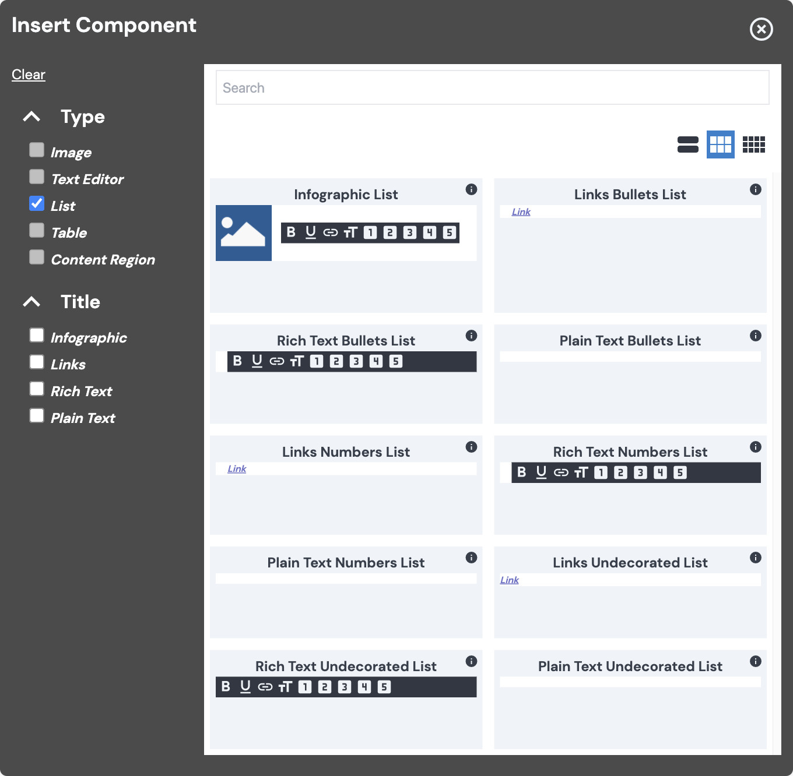

# Vital List Component

The Vital List Component is based on the [BodilessJS List Component](/Components/List). While
Bodiless List is a generic List component with tokens that can be combined however you choose, Vital
List builds upon it, providing a sensible default combination of its generic tokens (i.e., features
and styles), to help meet typical site-use expectations.

## Types of Lists

Vital List provides four categories of Lists:

- [Infographic](#infographic)
- [Links](#links)
- [Rich Text](#rich-text)
- [Plain Text](#plain-text)

Excluding Infographic Lists, each category offers the following variations:

- **Bullets:** A bulleted list, as you'd associate with a typical unordered list element (`<ul>`).
- **Numbers:** A numbered list, as you'd associate with a typical ordered list element (`<ol>`).
- **Undecorated:** A simple list without any item markers.

?> **Note:** Out of the box, Vital Lists are _single-level-only_ — i.e., they can't have nested
items. However, they do support multi-level (nested) lists if they're enabled by a Site Builder.

### Infographic

Each list item in an Infographic List is composed of an [Image](/Components/Image/) and a title.

- The Image can be [selected and configured](/Components/Image/#select-and-configure-an-image) as
  you'd expect.
- Selecting text in the title will bring up the [Rich Text Editor](/Components/Editors/RichText)
  toolbar, allowing you to apply some basic formatting.
  - The formatting options provided by the RTE toolbar in the Infographic List are the same as those
    in the [Rich Text Lists](#rich-text).

### Links

| Bullets | Numbers | Undecorated |
|:-------:|:-------:|:-----------:|
|  |  |  |

Each list item in a Links List is a [Link](/Components/Link/), and is
[configurable](/Components/Link/#add-a-link-to-a-component) as such.

### Rich Text

| Bullets | Numbers | Undecorated |
|:-------:|:-------:|:-----------:|
|  |  |  |

The text in each list item in a Rich Text List is able to be formatted via the [Rich Text
Editor](/Components/Editors/RichText) toolbar. The available formatting options are shown below:

### Plain Text

| Bullets | Numbers | Undecorated |
|:-------:|:-------:|:-----------:|
|  |  |  |

The Plain Text List is the most basic of the Vital Lists, with each list item being in plain
(unformatted) text.

## Content Editor Details

### Add a List

To add a Vital List Component to your page:

01. While in [Edit Mode](/ContentEditorUserGuide/#edit-mode), select a [Flow
    Container](/Components/FlowContainer/), and, within its context menu, under "Component," click
    **Add** (or **Swap**, if you're replacing a component).
01. In the "Insert Component" modal, under "Type," check the "List" checkbox, and select the type
    of list you would like to add.
    - Vital List provides the following list options by default:
      - [Infographic](#infographic)
      - [Links](#links)
      - [Rich Text](#rich-text)
      - [Plain Text](#plain-text)
    - **Note:** Your site may provide a different array of options for the List component.
    - Hover over the "i" icon for information about a particular list variation.  
    
01. [Edit your list](#edit-a-list) as desired.

### Edit a List

After [adding a Vital List](#add-a-list), you can add list items to it:

01. While in [Edit Mode](/ContentEditorUserGuide/#edit-mode), select the placeholder (or existing)
    text of the desired list item, and begin typing to make your edits.
    - You can select your text and format it via the [Rich Text Editor](/Components/Editors/RichText) toolbar.
01. Depending on the kind of Vital List you're editing, there will be additional things you can
    configure:
    - **[Infographic](#infographic):**
      - The Image can be [selected and configured](/Components/Image/#select-and-configure-an-image)
        like other Image components.
      - You can select your text and format it via the [Rich Text
        Editor](/Components/Editors/RichText) toolbar.
    - **[Links](#links):**
      - You can select the text and [add a link](/Components/Link/#add-a-link-to-a-component).
    - **[Rich Text](#rich-text):**
      - You can select your text and format it via the [Rich Text
        Editor](/Components/Editors/RichText) toolbar.

## Site Builder Details

At the site or global regional/brand library level, you can use the Vital List component as is, or
extend/shadow the existing component.

### Customizing List

#### Via Shadowing (*Preferred Method)

Define a Shadowing token collection as defined in [Shadowing Tokens](../Guides/ShadowingTokens).

File to shadow: `packages/{my-package}/src/shadow/@bodiless/vital-list/List.ts`
