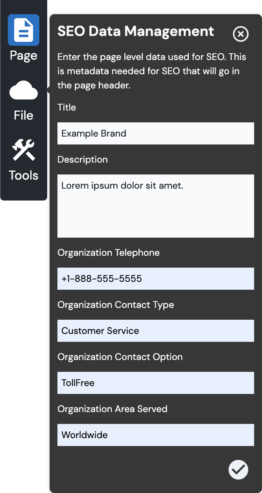
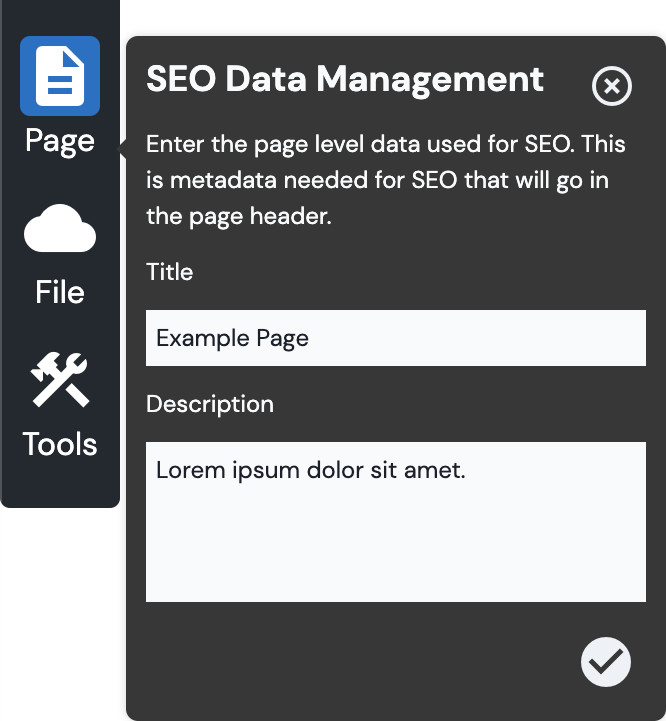

# SEO Data Management

## Default Basic SEO Meta Tags

Vital Meta provides some default basic meta tags to help with the SEO of your site and its pages.

If you desire additional meta tags, please follow the instructions to [add metadata fields to the
SEO form](/Components/Meta#add-metadata-fields-to-seo-form) in the editor interface.

For every page, you can set the following meta tags:

- [Title](#title-tag)
- [Description](#meta-description)

### Title Tag

A [title tag](https://moz.com/learn/seo/title-tag ':target=_blank') is an HTML element that
specifies the title of a web page. Title tags are displayed on search engine results pages (SERPs)
as the clickable headline for a given result, and are important for usability, SEO, and social
media. The title tag of a web page is meant to be a brief, accurate description of a page's content.

E.g.:

```html
<head><title>Example Title</title></head>
```

### Description

The [meta description](https://moz.com/learn/seo/meta-description ':target=_blank') is an HTML
attribute that provides a brief summary of a web page. Search engines often display the meta
description in search results, which can influence click-through rates.

E.g.:

```html
<meta name="description" content="This is an example of a meta description. This will often show up in search results." data-react-helmet="true">
```

## Default Organization SEO Meta Tags

For the homepage — if you're also using the Bodiless Schema.org (`@bodiless/schema-org`) package —
Vital Meta will provide some meta tag fields regarding your organization in the _SEO Data
Management_ form.

- [Organization Telephone](#organization-telephone)
- [Organization Contact Type](#organization-contact-type)
- [Organization Contact Option](#organization-contact-option)
- [Organization Area Served](#organization-area-served)

### Organization Telephone

A telephone number to use as a point of contact for your organization.

E.g.:

```html
<meta name="telephone" content="+1-888-555-5555" data-react-helmet="true">
```

### Organization Contact Type

The type of contact of the provided telephone number (e.g., "Customer Service").

E.g.:

```html
<meta name="contactType" content="Customer Service" data-react-helmet="true">
```

### Organization Contact Option

An option available for the provided telephone number (e.g., a toll-free number ("TollFree") or
support for hearing-impaired callers ("HearingImpairedSupported")).

E.g.:

```html
<meta name="contactOption" content="TollFree" data-react-helmet="true">
```

### Organization Area Served

The geographic area for which the provided telephone number offers service (e.g., "Worldwide", "US",
etc.).

E.g.:

```html
<meta name="areaServed" content="Worldwide" data-react-helmet="true">
```

## Content Editor Details

To provide SEO metadata for your site and its pages, you'll need to fill out the _SEO Data
Management_ form.

- For every page, you can set the page _Title_ and the page _Description_.
- For the homepage — in addition to the _Title_ and _Description_ — you'll be able to provide meta
  information related to your organization.
  - **Note:** You must be using the Bodiless Schema.org (`@bodiless/schema-org`) package to activate
    these fields.

| Homepage | Non-Homepage |
| -------- | ------------ |
|  |  |

01. While in [Edit Mode](/ContentEditorUserGuide/#edit-mode), (from the
    [Toolbar](/ContentEditorUserGuide/#toolbar)) click **Page > SEO** to open the _SEO Data
    Management_ form.
01. Provide values for the fields in the form, and click the checkmark to confirm.
    - If you're on a non-homepage, you'll just need to provide the page [Title](#title-tag) and
      [Description](#description).
    - If you're on the homepage — and using the Bodiless Schema.org package — you'll be able to
      enter [organization information](#default-organization-seo-meta-tags).

## Site Builder Details

### Add Metadata Fields to Editor Interface

As Vital Meta is based on [Bodiless Meta](/Components/Meta), the techniques used for adding more
fields to the Bodiless SEO form can also be applied here.

**See:** [Bodiless Meta Component : Add Metadata Fields to SEO Form](/Components/Meta#add-metadata-fields-to-seo-form)

This customization ought to be performed [via shadowing](#via-shadowing-preferred-method), as
described below.

### Customizing Meta Component

#### Via Shadowing (*Preferred Method)

Define a Shadowing token collection as defined in [Shadowing Tokens](../../Guides/ShadowingTokens).

File to shadow: `packages/{my-package}/src/shadow/@bodiless/vital-meta/MetaHelmet.ts`

For more details, visit [Shadowing Meta](./ShadowingMeta).
